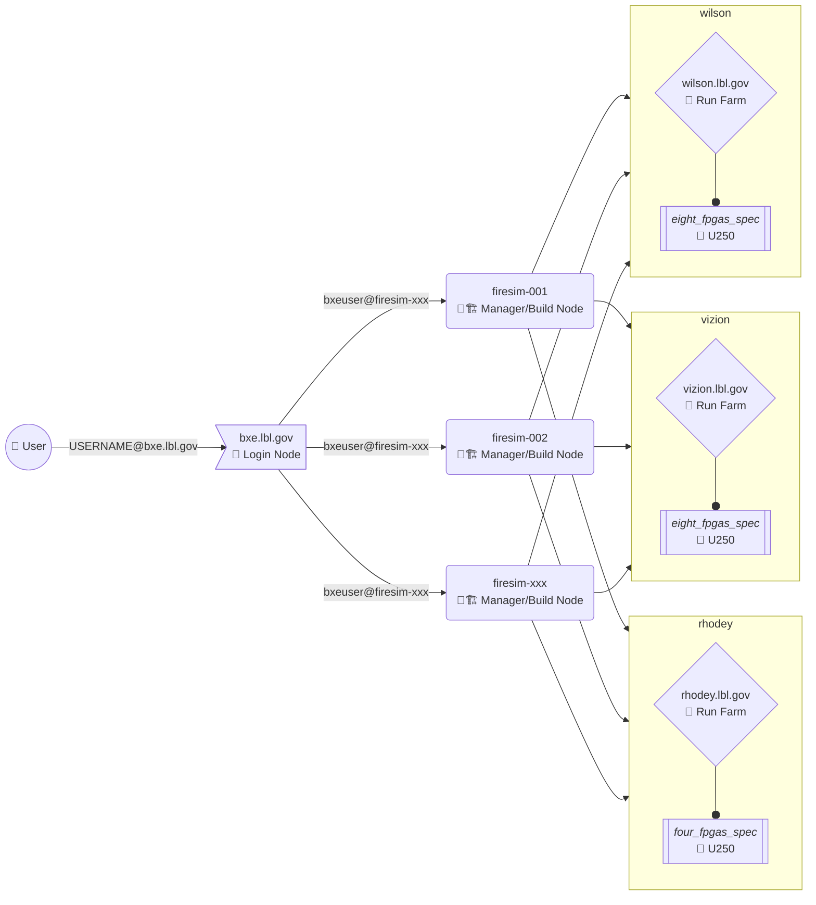

# About Our Research

<!-- 

    <h2>Project Overview</h2>
    
<em>Replace this with a comprehensive description of your research project, its objectives, and its place within Berkeley Lab's scientific mission.</em>

## Research Goals

<em>Describe the specific goals and objectives of your research. What questions are you trying to answer? What problems are you solving?</em>

## Methodology

<em>Explain your research approach, methodologies, computational techniques, or experimental procedures.</em>

## Key Features

- **Feature 1**: <em>Describe a key capability or innovation</em>
- **Feature 2**: <em>Describe another important aspect</em>
- **Feature 3**: <em>Highlight what makes your work unique</em>

## Applications

<em>Discuss the real-world applications of your research and its potential impact on science, technology, or society.</em>

    <strong>Collaboration Welcome:</strong> <em>If you're open to collaborations, describe what kind of partnerships you're seeking and how researchers can get involved.</em>

## Team

<em>Introduce your research team. You can include names, roles, and brief biographies of key team members.</em>

## Publications

<em>List recent publications, preprints, or other research outputs related to this project.</em>

## Funding

<em>Acknowledge funding sources, grants, or sponsors that support this research.</em> -->

## BXE FireSim VM Node

- vCPUs: 8-core x86-64 socket
- Memory: 128 GiB
- OS: [Xubuntu 20.04.6](https://xubuntu.org/release/20-04/)
- FPGA: AMD/Xilinx [Alveo U250](https://www.xilinx.com/products/boards-and-kits/alveo/u250.html)
  - AMD/Xilinx [Vitis 2023.1](https://www.xilinx.com/support/download/index.html/content/xilinx/en/downloadNav/vitis/2023-1.html)
- FireSim: [main](https://github.com/firesim/firesim/tree/c301eb5)

## BXE FireSim Cloud Architecture

When you want to access BXE FireSim, you need to request an account for the BXE Login Node. Once you are given an account, you are assigned a specific VM (`firesim-XXX`). Each Virtual Machine is set up with [FireSim](https://docs.fires.im/en/main/) per the instructions found for the [Xilinx Alveo U250 XDMA-based Getting Started Guide](https://docs.fires.im/en/main/Getting-Started-Guides/On-Premises-FPGA-Getting-Started/Xilinx-Alveo-U250-FPGAs.html) for FireSim.
